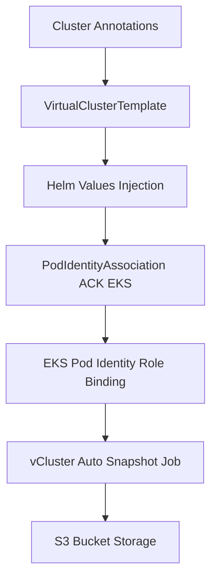

# vCluster Snapshot and Restore with EKS Pod Identity for AWS S3 Storage

> **Goal:** Scale vCluster **Auto Snapshots** to a large number of virtual cluster instances while securely using EKS Pod Identity for access to AWS S3 storage.

## Background

vCluster Platform supports [automatic snapshots](https://www.vcluster.com/docs/platform/use-platform/virtual-clusters/key-features/snapshots) that periodically back up virtual clusters for restore and disaster recovery.

When storing these snapshots in AWS S3, the [recommended authentication method](https://www.vcluster.com/docs/platform/use-platform/virtual-clusters/key-features/snapshots#authenticate-with-aws-pod-identity) is **EKS Pod Identity**, which provides fine-grained IAM access without needing static credentials or IRSA role bindings per namespace.

However, as the number of virtual clusters increases, managing Pod Identity Associations manually becomes more challenging:

- Each vCluster needs its own `PodIdentityAssociation`
- Each association must reference the correct EKS cluster name and IAM role
- Each vCluster must also be configured with the correct S3 bucket URL and region

Without automation, this quickly becomes a bottleneck when managing **dozens or hundreds of virtual clusters**.

## Approach

To make EKS Pod Identity scale efficiently across many virtual cluster instances, we combine:

1. **EKS ACK ([AWS Controllers for Kubernetes](https://aws-controllers-k8s.github.io/community/docs/community/overview/))**  
   Deployed to the host cluster where the virtual cluster instance is deployed, EKS ACK provides the `PodIdentityAssociation` CRD, allowing Pod Identity configuration to be managed declaratively in Kubernetes.

2. **vCluster Platform Virtual Cluster Templates**  
   Used to dynamically inject configuration (like IAM roles, S3 bucket URLs, and timezones) from the host [vCluster Platform `Cluster` resource](https://www.vcluster.com/docs/platform/api/resources/clusters/) annotations, along with [platform-specific parameter values](https://www.vcluster.com/docs/platform/administer/templates/parameters#platform-specific-parameter-values), directly into each vCluster’s configuration and associated `PodIdentityAssociation`. The EKS ACK `PodIdentityAssociation` resource is created in the virtual cluster host namespace via the `spec.template.spaceTemplate.objects` field.

This approach enables:
- Fully declarative Pod Identity and snapshot setup for every vCluster  
- Centralized management of cluster-specific S3 and IAM configuration  
- Seamless GitOps integration with Argo CD or Flux  

## Cluster Configuration Example

Each vCluster Platform `Cluster` is annotated with the information required for S3 snapshots and Pod Identity binding:

```yaml
apiVersion: management.loft.sh/v1
kind: Cluster
metadata:
  name: loft-cluster
  annotations:
    demos.vcluster.com/eks-cluster-name: vcluster-platform-eks
    demos.vcluster.com/s3-url: s3://my-vcluster-snapshots-19990
    demos.vcluster.com/timezone: America/New_York
    demos.vcluster.com/vcluster-snapshots-arn: arn:aws:iam::<ACCOUNT_ID>:role/vcluster-s3-snapshots
spec:
  displayName: Local Cluster
  description: The local EKS cluster where vCluster Platform is installed
  local: true
  managementNamespace: vcluster-platform
```

Each annotation maps to a reusable configuration field consumed by the Virtual Cluster Template:

| Annotation Key | Description |
|----------------|-------------|
| `demos.vcluster.com/eks-cluster-name` | EKS cluster name for Pod Identity Association |
| `demos.vcluster.com/s3-url` | S3 bucket URI used for vCluster snapshot storage (e.g., `s3://my-vcluster-snapshots`) |
| `demos.vcluster.com/timezone` | Default timezone for snapshot and sleep scheduling (e.g., `America/New_York`) |
| `demos.vcluster.com/vcluster-snapshots-arn` | IAM role ARN used by Pod Identity to access the S3 bucket |

## Template Overview

The `VirtualClusterTemplate` enables:
- Automatic S3 snapshot configuration  
- Dynamic timezone and schedule injection  
- Creation of a `PodIdentityAssociation` per vCluster  
- Adjustable retention parameters  

This lets hundreds of virtual cluster instances share the same template logic, while still targeting the correct AWS S3 bucket and IAM role for the host cluster.

```yaml
kind: VirtualClusterTemplate
apiVersion: management.loft.sh/v1
metadata:
  name: auto-snapshot-vcluster
spec:
  displayName: Automatic Snapshots Virtual Cluster
  description: Template enabling automatic S3 snapshots with EKS Pod Identity.
  owner:
    team: loft-admins
  versions:
    - version: 1.0.0
      template:
        pro:
          enabled: true
        helmRelease:
          chart:
            version: 0.29.1
          values: |+
            external:
              platform:
                autoSnapshot:
                  enabled: true
                  schedule: "20 7-17/2 * * 1-5"
                  retention:
                    period: {{ .Values.retentionPeriod }}
                    maxSnapshots: {{ .Values.maxSnapshots }}
                  timezone: '{{ default "America/New_York" (index .Values.loft.clusterAnnotations "demos.vcluster.com/timezone") }}'
                  storage:
                    type: s3
                    s3:
                      url: '{{ index .Values.loft.clusterAnnotations "demos.vcluster.com/s3-url" }}'
            sleepMode:
              enabled: true
              autoSleep:
                afterInactivity: 35m
              timeZone: '{{ default "America/New_York" (index .Values.loft.clusterAnnotations "demos.vcluster.com/timezone") }}'
              autoWakeup:
                schedule: 10 7-17 * * 1-5
            controlPlane:
              backingStore:
                etcd:
                  embedded:
                    enabled: true
              coredns:
                embedded: true
        spaceTemplate:
          objects: |-
            apiVersion: eks.services.k8s.aws/v1alpha1
            kind: PodIdentityAssociation
            metadata:
              name: vc-{{ .Values.loft.virtualClusterName }}-snapshot-pod-identity
            spec:
              clusterName: '{{ index .Values.loft.clusterAnnotations "demos.vcluster.com/eks-cluster-name" }}'
              namespace: {{ .Values.loft.virtualClusterNamespace }}
              serviceAccount: vc-{{ .Values.loft.virtualClusterName }}
              roleARN: '{{ index .Values.loft.clusterAnnotations "demos.vcluster.com/vcluster-snapshots-arn" }}'
      parameters:
        - variable: maxSnapshots
          label: Maximum vCluster Snapshots
          type: number
          defaultValue: 5
          min: 1
          max: 10
          section: Snapshot Config
        - variable: retentionPeriod
          label: Snapshot Retention Period (days)
          type: number
          defaultValue: 5
          min: 1
          max: 10
          section: Snapshot Config
```

## How It Works

1. **Cluster Annotations**  
   Each vCluster Platform `Cluster` resource defines environment-specific configuration such as IAM role, S3 bucket URL, and timezone via annotations.

2. **Virtual Cluster Template Injection**  
   When a new virtual cluster instance is created from this template, the placeholders  
   `.Values.loft.clusterAnnotations[...]` automatically inject those annotation values at runtime.

3. **Pod Identity Association**  
   The template’s `spaceTemplate.objects` block creates a `PodIdentityAssociation` in the virtual cluster host (EKS) cluster,  
   binding the vCluster’s service account to the IAM role from annotations.

4. **Auto Snapshot Configuration**  
   The virtual cluster instance Helm values configure `autoSnapshot` schedule, retention period, timezone, and S3 backend.  
   Snapshots are automatically stored in the annotated S3 bucket.

5. **Sleep Mode Alignment**  
   Sleep and wakeup schedules share the same timezone for consistent scheduling behavior.

## Benefits

- **Scales cleanly:** Handles hundreds of virtual cluster instances without manual IAM or Pod Identity management.  
- **Declarative:** Everything is GitOps-managed through YAML; no imperative setup steps.  
- **Secure:** Each vCluster’s service account uses least-privilege IAM via Pod Identity.  
- **Consistent:** Schedules, retention, and timezone come from centralized cluster annotations.  
- **Reusable:** A single Virtual Cluster Template supports many tenants, clusters, and environments.

## Operational Notes

- **EKS ACK dependency:** The ACK EKS controller that provides the `PodIdentityAssociation` CRD must be installed and healthy in the host cluster.  
- **ServiceAccount naming:** The vCluster control plane’s service account defaults to `vc-<vclusterName>`.  
  Adjust the template if you use a different name.  
- **S3 pathing:** You can use a shared S3 bucket with per-vCluster folder prefixes or separate buckets per tenant.  
- **Timezone default:** If the `demos.vcluster.com/timezone` annotation is missing, the template falls back to `"America/New_York"`.

## IAM & S3 Permissions Example

Attach a minimal IAM policy to the `vcluster-s3-snapshots` role (tighten as needed):

```json
{
  "Version": "2012-10-17",
  "Statement": [
    {
      "Effect": "Allow",
      "Action": ["s3:ListBucket"],
      "Resource": "arn:aws:s3:::my-vcluster-snapshots-19990"
    },
    {
      "Effect": "Allow",
      "Action": ["s3:PutObject", "s3:GetObject", "s3:DeleteObject"],
      "Resource": "arn:aws:s3:::my-vcluster-snapshots-19990/*"
    }
  ]
}
```

Ensure the IAM trust policy for this role includes the EKS Pod Identity service principal.

## Validation Steps

1. **Create a vCluster instance** using this template.  
2. **Verify Pod Identity association:**

```bash
kubectl -n <vcluster-host-namespace> get podidentityassociations.eks.services.k8s.aws
```

3. **Check snapshot logs:**

```bash
   kubectl -n vcluster-platform logs deploy/loft | grep snapshot
```

4. **Confirm S3 uploads:**  
   Verify new objects appear in your S3 bucket under vcluster/<vcluster-name>/.

## Troubleshooting

| Symptom | Possible Cause | Fix |
|----------|----------------|-----|
| `PodIdentityAssociation` not created | ACK EKS controller missing or CRD not installed | Install the ACK EKS controller and re-apply the template |
| `AccessDenied` on S3 operations | IAM role not linked or trust policy invalid | Check `roleARN`, trust policy, and bucket permissions |
| Snapshots not appearing in S3 | Invalid cron expression or timezone misconfiguration | Validate `autoSnapshot.schedule` and `timezone` values |
| Snapshot job errors | IAM policy missing `s3:PutObject` or bucket enforcing restrictive block rules | Update IAM policy and bucket settings, then re-test |

---

## Future Extensions

- Add per-tenant or per-project overrides for snapshot retention and scheduling.  
- Integrate with **Crossplane** or **Terraform NodeProviders** to provision buckets and IAM roles dynamically.  
- Extend this pattern to **GCP** or **Azure** storage backends using provider-specific CRDs and annotation injection.

---

## Flow Diagram

You can visualize the automation chain with a Mermaid diagram:


